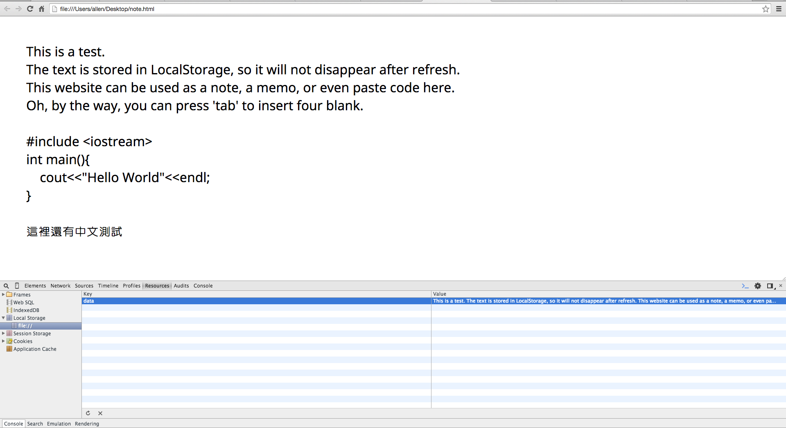

#Web Notepad

The "Web Notepad" project is a web app for notes or memos, using css and pure javascript.

Every content is stored in LocalStorage, so it'll be saved after refreshing or even after restarting.

##Screenshots

##License
This project is released under MIT License, please read "[LICENSE](LICENSE)" for more information.